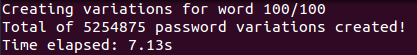

# Wordlist Generator

Wordlist Generator allows you to create custom wordlists that can be used in different situations, such as wordlist attacks. This is especially designed to be used when you have gained some knowledge of the target. Alternatively, the program can be used to create more variations for different default passwords. The generator is written for Python 3+ interpreter, doesn't require any non-native modules and is tested in Linux (Ubuntu 16.04, Kali 2017.2) and Windows (10) environments. 

## How to use

The generator takes two command line parameters. The first parameter provided is an input file. The input file should contain a list of words (one per line, no spaces), or at least one word. The second parameter is an output file, which will be your new wordlist. The output filename can be anything that respects the basic filename rules. While generally whitespaces in names are allowed, their use is highly discouraged and may lead to unexpected results.

**Only one step, open your command prompt and type the following**

`python wlgenerator.py <your_inputfile> <your_outputfile>`

Output may look something like this

On line 95 of the source code that can be found [here](https://github.com/Offorensics/wordlistcreator/blob/master/src/wlgenerator.py "here"), notice the comment about changing _clear_ to _cls_ if you are running the program in a Windows machine.

This information package doesn't intend to dive in more details. If you are interested to know more about this program, please visit [Offorensic's article](http://offorensics.com/custom-wordlist-generator-with-python/ "Offorensic's article") about it.
